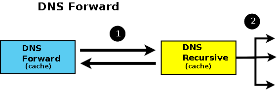

# bind

* [DNS Configuration Types](http://www.zytrax.com/books/dns/ch4/index.html)

## Forwarding (a.k.a Proxy) Name Servers



* named.conf

```
options {
    listen-on port 53 { any; };
    directory   "/var/named";
    dump-file   "/var/named/data/cache_dump.db";
    statistics-file "/var/named/data/named_stats.txt";
    memstatistics-file "/var/named/data/named_mem_stats.txt";
    allow-query     { any; };

    forwarders { 8.8.8.8; 8.8.4.4; };
    forward only;

    recursion yes;

    dnssec-enable no;
    dnssec-validation no;
    dnssec-lookaside auto;

    bindkeys-file "/etc/named.iscdlv.key";
    managed-keys-directory "/var/named/dynamic";
    pid-file "/run/named/named.pid";
    session-keyfile "/run/named/session.key";
};

logging {
        channel default_debug {
                file "data/named.run";
                severity dynamic;
        };
};

zone "." IN {
    type hint;
    file "named.ca";
};

include "/etc/named.rfc1912.zones";
include "/etc/named.root.key";
```
