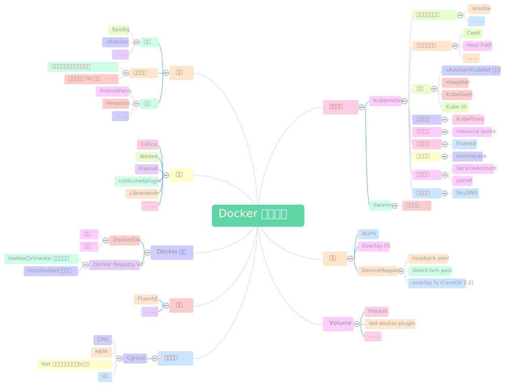

# Docker 知识梳理

## 概览

## Docker 资源隔离

[Resource Management Guide -- redhat](https://access.redhat.com/documentation/en-US/Red_Hat_Enterprise_Linux/7/html/Resource_Management_Guide/index.html)

### 理论基础

* Linux Cgroup
    * [Docker基础技术：Linux CGroup -- CoolShell](http://coolshell.cn/articles/17049.html)
* Linux NameSpace
    * [Docker基础技术：Linux Namespace（上）-- CoolShell](http://coolshell.cn/articles/17010.html)
    * [Docker基础技术：Linux Namespace（下）-- CoolShell](http://coolshell.cn/articles/17029.html)

### 实践操作

* [CPU]()
* [MEM]()
* [IO]()
* [NET]()
