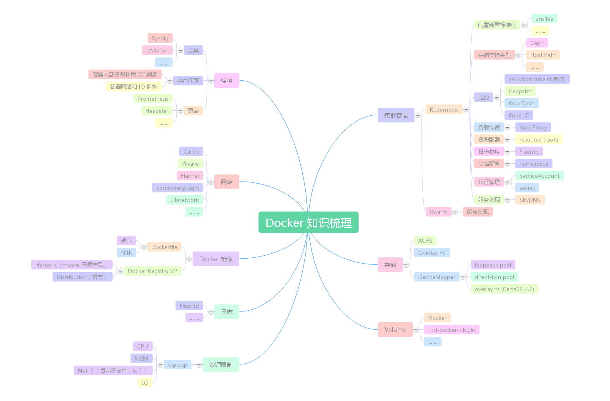

# Docker 知识梳理

## 概览

## Docker 资源限制

* 红帽资源管理官方文档
    * [Resource Management Guide](https://access.redhat.com/documentation/en-US/Red_Hat_Enterprise_Linux/7/html/Resource_Management_Guide/index.html)

### 理论基础

* Linux Cgroup
    * [Docker基础技术：Linux CGroup](http://coolshell.cn/articles/17049.html)
        * From [酷壳 CoolShell](http://coolshell.cn)
* Linux NameSpace
    * [Docker基础技术：Linux Namespace（上）](http://coolshell.cn/articles/17010.html)
        * From [酷壳 CoolShell](http://coolshell.cn)
    * [Docker基础技术：Linux Namespace（下）](http://coolshell.cn/articles/17029.html)
        * From [酷壳 CoolShell](http://coolshell.cn)

### 实践操作

* [Docker MEM、CPU、IO 资源限制](resource-limit.md)
* [NET ?]()

## Docker 存储驱动

* Docker 官方文档
    * [Docker and the Device Mapper storage driver](https://docs.docker.com/engine/userguide/storagedriver/device-mapper-driver/)

### 实践操作

* [Docker 使用 Direct LVM devicemapper 设备](direct-lvm-devicemapper.md)
    * issue: 生产环境应该如何监控 container rootfs size ？
