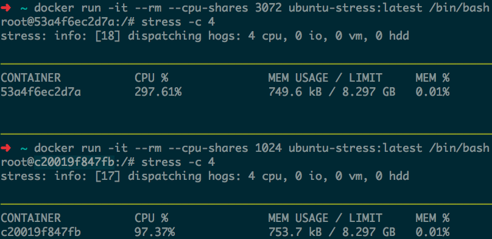
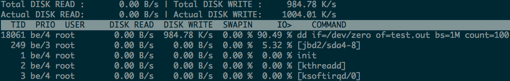

# Docker 资源限制

Docker 目前支持 MEM、CPU、IO 资源限制

## 一、压测工具

* [stress](http://people.seas.harvard.edu/~apw/stress/)

通过如下 Dockerfile 构建简单的测试镜像

```
➜  cat Dockerfile
FROM ubuntu:latest

RUN apt-get update && \
    apt-get install stress
➜   docker build -t ubuntu-stress:latest .
```

## 二、内存测试

* [Runtime constraints on resources](https://docs.docker.com/engine/reference/run/#runtime-constraints-on-resources)

* 目前 Docker 支持内存资源限制选项
    * `-m`, `--memory=""`
        * Memory limit (format: `<number>[<unit>]`). Number is a positive integer. Unit can be one of `b`, `k`, `m`, or `g`. Minimum is 4M.
    * `--memory-swap=""`
        * Total memory limit (memory + swap, format: `<number>[<unit>]`). Number is a positive integer. Unit can be one of `b`, `k`, `m`, or `g`.
    * `--memory-swappiness=""`
        * Tune a container’s memory swappiness behavior. Accepts an integer between 0 and 100.
    * `--shm-size=""`
        * Size of `/dev/shm`. The format is `<number><unit>`. number must be greater than 0. Unit is optional and can be `b` (bytes), `k` (kilobytes), `m` (megabytes), or `g` (gigabytes). If you omit the unit, the system uses bytes. If you omit the size entirely, the system uses `64m`.
        * 根据实际需求设置，这里不作过多的介绍
    * `--memory-reservation=""`
        * Memory soft limit (format: `<number>[<unit>]`). Number is a positive integer. Unit can be one of `b`, `k`, `m`, or `g`.
    * `--kernel-memory=""`
        * Kernel memory limit (format: `<number>[<unit>]`). Number is a positive integer. Unit can be one of `b`, `k`, `m`, or `g`. Minimum is 4M.
        * kernel memory 没有特殊需求，则无需额外设置
    * `--oom-kill-disable=false`
        * Whether to disable OOM Killer for the container or not.

默认启动一个 container，对于容器的内存是没有任何限制的。

```
➜  ~ docker help run | grep memory  # 测试 docker 版本 1.10.2，宿主系统 Ubuntu 14.04.1
  --kernel-memory                 Kernel memory limit
  -m, --memory                    Memory limit
  --memory-reservation            Memory soft limit
  --memory-swap                   Swap limit equal to memory plus swap: '-1' to enable unlimited swap
  --memory-swappiness=-1          Tune container memory swappiness (0 to 100)
➜  ~
```

### 2.1 `-m ... --memory-swap ...`

* `docker run -it --rm -m 100M --memory-swap -1 ubuntu-stress:latest /bin/bash`

指定限制内存大小并且设置 memory-swap 值为 -1，表示容器程序使用内存受限，而 swap 空间使用不受限制（宿主 swap 支持使用多少则容器即可使用多少。如果 `--memory-swap` 设置小于 `--memory` 则设置不生效，使用默认设置）。

```
➜  ~ docker run -it --rm -m 100M --memory-swap -1 ubuntu-stress:latest /bin/bash
root@4b61f98e787d:/# stress --vm 1 --vm-bytes 1000M  # 通过 stress 工具对容器内存做压测
stress: info: [14] dispatching hogs: 0 cpu, 0 io, 1 vm, 0 hdd
```

使用 `docker stats` 查看当前容器内存资源使用：

```
➜  ~ docker stats 4b61f98e787d
CONTAINER           CPU %               MEM USAGE/LIMIT     MEM %               NET I/O
4b61f98e787d        6.74%               104.8 MB/104.9 MB   99.94%              4.625 kB/648 B
```

通过 `top` 实时监控 stress 进程内存占用：

```
➜  ~ pgrep stress
8209
8210    # 需查看 stress 子进程占用，
➜  ~ top -p 8210    # 显示可以得知 stress 的 RES 占用为 100m，而 VIRT 占用为 1007m
top - 17:51:31 up 35 min,  2 users,  load average: 1.14, 1.11, 1.06
Tasks:   1 total,   0 running,   1 sleeping,   0 stopped,   0 zombie
%Cpu(s):  0.2 us,  3.1 sy,  0.0 ni, 74.8 id, 21.9 wa,  0.0 hi,  0.0 si,  0.0 st
KiB Mem:   8102564 total,  6397064 used,  1705500 free,   182864 buffers
KiB Swap: 15625212 total,  1030028 used, 14595184 free.  4113952 cached Mem

  PID USER      PR  NI    VIRT    RES    SHR S  %CPU %MEM     TIME+ COMMAND
 8210 root      20   0 1007.1m 100.3m   0.6m D  13.1  1.3   0:22.59 stress
```

也可以通过如下命令获取 stress 进程的 swap 占用：

```
➜  ~ for file in /proc/*/status ; do awk '/VmSwap|Name/{printf $2 " " $3}END{ print ""}' $file; done | sort -k 2 -n -r | grep stress
stress 921716 kB
stress 96 kB
➜  ~
```

* `docker run -it --rm -m 100M ubuntu-stress:latest /bin/bash`

按照官方文档的理解，如果指定 `-m` 内存限制时不添加 `--memory-swap` 选项，则表示容器中程序可以使用 100M 内存和 100M swap 内存。默认情况下，`--memory-swap` 会被设置成 memory 的 2倍。

> We set memory limit(300M) only, this means the processes in the container can use 300M memory and 300M swap memory, by default, the total virtual memory size `--memory-swap` will be set as double of memory, in this case, memory + swap would be 2*300M, so processes can use 300M swap memory as well.

如果按照以上方式运行容器提示如下信息：

```
WARNING: Your kernel does not support swap limit capabilities, memory limited without swap.
```

可参考 [Adjust memory and swap accounting](https://docs.docker.com/engine/installation/linux/ubuntulinux/) 获取解决方案:

* To enable memory and swap on system using GNU GRUB (GNU GRand Unified Bootloader), do the following:
    * Log into Ubuntu as a user with sudo privileges.
    * Edit the /etc/default/grub file.
    * Set the GRUB_CMDLINE_LINUX value as follows:
        * `GRUB_CMDLINE_LINUX="cgroup_enable=memory swapaccount=1"`
    * Save and close the file.
    * Update GRUB.
        * `$ sudo update-grub`
    * Reboot your system.

```
➜  ~ docker run -it --rm -m 100M ubuntu-stress:latest /bin/bash
root@ed670cdcb472:/# stress --vm 1 --vm-bytes 200M # 压测 200M，stress 进程会被立即 kill 掉
stress: info: [17] dispatching hogs: 0 cpu, 0 io, 1 vm, 0 hdd
stress: FAIL: [17] (416) <-- worker 18 got signal 9
stress: WARN: [17] (418) now reaping child worker processes
stress: FAIL: [17] (452) failed run completed in 2s
root@ed670cdcb472:/# stress --vm 1 --vm-bytes 199M
```

`docker stats` 和 top 获取资源占用情况：

```
➜  ~ docker stats ed670cdcb472
CONTAINER           CPU %               MEM USAGE / LIMIT     MEM %               NET I/O             BLOCK I/O
ed670cdcb472        13.35%              104.3 MB / 104.9 MB   99.48%              6.163 kB / 648 B    26.23 GB / 29.21 GB
➜  ~ pgrep stress
16322
16323
➜  ~ top -p 16323
top - 18:12:31 up 56 min,  2 users,  load average: 1.07, 1.07, 1.05
Tasks:   1 total,   0 running,   1 sleeping,   0 stopped,   0 zombie
%Cpu(s):  4.8 us,  4.0 sy,  0.0 ni, 69.6 id, 21.4 wa,  0.0 hi,  0.2 si,  0.0 st
KiB Mem:   8102564 total,  6403040 used,  1699524 free,   184124 buffers
KiB Swap: 15625212 total,   149996 used, 15475216 free.  4110440 cached Mem

  PID USER      PR  NI    VIRT    RES    SHR S  %CPU %MEM     TIME+ COMMAND
16323 root      20   0  206.1m  91.5m   0.6m D   9.9  1.2   0:52.58 stress
```

* `docker run -it -m 100M --memory-swap 400M ubuntu-stress:latest /bin/bash`

```
➜  ~ docker run -it --rm -m 100M --memory-swap 400M ubuntu-stress:latest /bin/bash
root@5ed1fd88a1aa:/# stress --vm 1 --vm-bytes 400M  # 压测到 400M 程序会被 kill
stress: info: [24] dispatching hogs: 0 cpu, 0 io, 1 vm, 0 hdd
stress: FAIL: [24] (416) <-- worker 25 got signal 9
stress: WARN: [24] (418) now reaping child worker processes
stress: FAIL: [24] (452) failed run completed in 3s
root@5ed1fd88a1aa:/# stress --vm 1 --vm-bytes 399M  # 压测到 399M 程序刚好可以正常运行（这个值已经处于临界了，不保证不被 kill）
```

`docker stats` 和 top 获取资源占用情况：

```
➜  ~ docker stats 5ed1fd88a1aa
CONTAINER           CPU %               MEM USAGE / LIMIT     MEM %               NET I/O             BLOCK I/O
5ed                 12.44%              104.8 MB / 104.9 MB   99.92%              4.861 kB / 648 B    9.138 GB / 10.16 GB
➜  ~ pgrep stress
22721
22722
➜  ~ top -p 22722
top - 18:18:58 up  1:02,  2 users,  load average: 1.04, 1.04, 1.05
Tasks:   1 total,   0 running,   1 sleeping,   0 stopped,   0 zombie
%Cpu(s):  1.4 us,  3.3 sy,  0.0 ni, 73.7 id, 21.6 wa,  0.0 hi,  0.1 si,  0.0 st
KiB Mem:   8102564 total,  6397416 used,  1705148 free,   184608 buffers
KiB Swap: 15625212 total,   366160 used, 15259052 free.  4102076 cached Mem

  PID USER      PR  NI    VIRT    RES    SHR S  %CPU %MEM     TIME+ COMMAND
22722 root      20   0  406.1m  84.1m   0.7m D  11.7  1.1   0:08.82 stress
```

根据实际测试可以理解，`-m` 为物理内存上限，而 `--memory-swap` 则是 memory + swap 之和，当压测值是 `--memory-swap` 上限时，则容器中的进程会被直接 OOM kill。

### 2.2 `-m ... --memory-swappiness ...`

swappiness 可以认为是宿主 `/proc/sys/vm/swappiness` 设定：

> Swappiness is a Linux kernel parameter that controls the relative weight given to swapping out runtime memory, as opposed to dropping pages from the system page cache. Swappiness can be set to values between 0 and 100 inclusive. A low value causes the kernel to avoid swapping, a higher value causes the kernel to try to use swap space. [Swappiness](https://en.wikipedia.org/wiki/Swappiness)

`--memory-swappiness=0` 表示禁用容器 swap 功能(这点不同于宿主机，宿主机 swappiness 设置为 0 也不保证 swap 不会被使用):

* `docker run -it --rm -m 100M --memory-swappiness=0 ubuntu-stress:latest /bin/bash`

```
➜  ~ docker run -it --rm -m 100M --memory-swappiness=0 ubuntu-stress:latest /bin/bash
root@e3fd6cc73849:/# stress --vm 1 --vm-bytes 100M  # 没有任何商量的余地，到达 100M 直接被 kill
stress: info: [18] dispatching hogs: 0 cpu, 0 io, 1 vm, 0 hdd
stress: FAIL: [18] (416) <-- worker 19 got signal 9
stress: WARN: [18] (418) now reaping child worker processes
stress: FAIL: [18] (452) failed run completed in 0s
root@e3fd6cc73849:/#
```

### 2.3 `--memory-reservation ...`

`--memory-reservation ...` 选项可以理解为内存的软限制。如果不设置 `-m` 选项，那么容器使用内存可以理解为是不受限的。按照官方的说法，memory reservation 设置可以确保容器不会长时间占用大量内存。

### 2.4 `--oom-kill-disable`

```
➜  ~ docker run -it --rm -m 100M --memory-swappiness=0 --oom-kill-disable ubuntu-stress:latest /bin/bash
root@f54f93440a04:/# stress --vm 1 --vm-bytes 200M  # 正常情况不添加 --oom-kill-disable 则会直接 OOM kill，加上之后则达到限制内存之后也不会被 kill
stress: info: [17] dispatching hogs: 0 cpu, 0 io, 1 vm, 0 hdd
```

但是如果是以下的这种没有对容器作任何资源限制的情况，添加 `--oom-kill-disable` 选项就比较 __危险__ 了：

```
$ docker run -it --oom-kill-disable ubuntu:14.04 /bin/bash
```

因为此时容器内存没有限制，并且不会被 oom kill，此时系统则会 kill 系统进程用于释放内存。

### 2.5 `--kernel-memory`

> Kernel memory is fundamentally different than user memory as kernel memory can’t be swapped out. The inability to swap makes it possible for the container to block system services by consuming too much kernel memory. Kernel memory includes:

* stack pages
* slab pages
* sockets memory pressure
* tcp memory pressure

这里直接引用 Docker 官方介绍，如果无特殊需求，kernel-memory 一般无需设置，这里不作过多说明。

### 2.6、内存资源限制 Docker 源码解析

关于 Docker 资源限制主要是依赖 Linux cgroups 去实现的，关于 cgroups 资源限制实现可以参考：[Docker背后的内核知识——cgroups资源限制](http://www.infoq.com/cn/articles/docker-kernel-knowledge-cgroups-resource-isolation/), libcontainer 配置相关的选项：

* `github.com/opencontainers/runc/libcontainer/cgroups/fs/memory.go`

```
68 func (s *MemoryGroup) Set(path string, cgroup *configs.Cgroup) error {
69     if cgroup.Resources.Memory != 0 {
70         if err := writeFile(path, "memory.limit_in_bytes", strconv.FormatInt(cgroup.Resources.Memory, 10)); err != nil {
71             return err
72         }
73     }
74     if cgroup.Resources.MemoryReservation != 0 {
75         if err := writeFile(path, "memory.soft_limit_in_bytes", strconv.FormatInt(cgroup.Resources.MemoryReservation, 10)); err != nil {
76             return err
77         }
78     }
79     if cgroup.Resources.MemorySwap > 0 {
80         if err := writeFile(path, "memory.memsw.limit_in_bytes", strconv.FormatInt(cgroup.Resources.MemorySwap, 10)); err != nil {
81             return err   // 如果 MemorySwap 没有设置，则 cgroup 默认设定值是 Memory 2 倍，详见后文测试
82         }
83     }
84     if cgroup.Resources.OomKillDisable {
85         if err := writeFile(path, "memory.oom_control", "1"); err != nil {
86             return err
87         }
88     }
89     if cgroup.Resources.MemorySwappiness >= 0 && cgroup.Resources.MemorySwappiness <= 100 {
90         if err := writeFile(path, "memory.swappiness", strconv.FormatInt(cgroup.Resources.MemorySwappiness, 10)); err != nil {
91             return err
92         }
93     } else if cgroup.Resources.MemorySwappiness == -1 {
94         return nil  // 如果 MemorySwappiness 设置为 -1，则不做任何操作，经测试默认值为 60，后文附测试
95     } else {
96         return fmt.Errorf("invalid value:%d. valid memory swappiness range is 0-100", cgroup.Resources.MemorySwappiness)
97     }
98
99     return nil
100 }
```

附测试：

```
➜  ~ docker run -it --rm -m 100M --memory-swappiness=-1 ubuntu-stress:latest /bin/bash
root@fbe9b0abf665:/#
```

查看宿主对应 container cgroup 对应值：

```
➜  ~ cd /sys/fs/cgroup/memory/docker/fbe9b0abf665b77fff985fd04f85402eae83eb7eb7162a30070b5920d50c5356
➜  fbe9b0abf665b77fff985fd04f85402eae83eb7eb7162a30070b5920d50c5356 cat memory.swappiness           # swappiness 如果设置 -1 则该值默认为 60
60
➜  fbe9b0abf665b77fff985fd04f85402eae83eb7eb7162a30070b5920d50c5356 cat memory.memsw.limit_in_bytes # 为设置的 memory 2 倍
209715200
➜  fbe9b0abf665b77fff985fd04f85402eae83eb7eb7162a30070b5920d50c5356
```

## 三、CPU 测试

* [Runtime constraints on resources](https://docs.docker.com/engine/reference/run/#runtime-constraints-on-resources)

* 目前 Docker 支持 CPU 资源限制选项
    * `-c`, `--cpu-shares=0`
        * CPU shares (relative weight)
        * -c 选项将会废弃，推荐使用 `--cpu-shares`
    * `--cpu-period=0`
        * Limit the CPU CFS (Completely Fair Scheduler) period
    * `--cpuset-cpus=""`
        * CPUs in which to allow execution (0-3, 0,1)
    * `--cpuset-mems=""`
        * Memory nodes (MEMs) in which to allow execution (0-3, 0,1). Only effective on NUMA systems.
    * `--cpu-quota=0`
        * Limit the CPU CFS (Completely Fair Scheduler) quota

```
➜  ~ docker help run | grep cpu
  --cpu-shares                    CPU shares (relative weight)
  --cpu-period                    Limit CPU CFS (Completely Fair Scheduler) period
  --cpu-quota                     Limit CPU CFS (Completely Fair Scheduler) quota
  --cpuset-cpus                   CPUs in which to allow execution (0-3, 0,1)
  --cpuset-mems                   MEMs in which to allow execution (0-3, 0,1)
```

### 3.1 CPU share constraint: `-c` or `--cpu-shares`

默认所有的容器对于 CPU 的利用占比都是一样的，`-c` 或者 `--cpu-shares` 可以设置 CPU 利用率权重，默认为 1024，可以设置权重为 2 或者更高(单个 CPU 为 1024，两个为 2048，以此类推)。如果设置选项为 0，则系统会忽略该选项并且使用默认值 1024。通过以上设置，只会在 CPU 密集(繁忙)型运行进程时体现出来。当一个 container 空闲时，其它容器都是可以占用 CPU 的。cpu-shares 值为一个相对值，实际 CPU 利用率则取决于系统上运行容器的数量。

假如一个 1core 的主机运行 3 个 container，其中一个 cpu-shares 设置为 1024，而其它 cpu-shares 被设置成 512。当 3 个容器中的进程尝试使用 100% CPU 的时候「尝试使用 100% CPU 很重要，此时才可以体现设置值」，则设置 1024 的容器会占用 50% 的 CPU 时间。如果又添加一个 cpu-shares 为 1024 的 container，那么两个设置为 1024 的容器 CPU 利用占比为 33%，而另外两个则为 16.5%。简单的算法就是，所有设置的值相加，每个容器的占比就是 CPU 的利用率，如果只有一个容器，那么此时它无论设置 512 或者 1024，CPU 利用率都将是 100%。当然，如果主机是 3core，运行 3 个容器，两个 cpu-shares 设置为 512，一个设置为 1024，则此时每个 container 都能占用其中一个 CPU 为 100%。

测试主机「4core」当只有 1 个 container 时，可以使用任意的 CPU：

```
➜  ~ docker run -it --rm --cpu-shares 512 ubuntu-stress:latest /bin/bash
root@4eb961147ba6:/# stress -c 4
stress: info: [17] dispatching hogs: 4 cpu, 0 io, 0 vm, 0 hdd
➜  ~ docker stats 4eb961147ba6
CONTAINER           CPU %               MEM USAGE / LIMIT     MEM %               NET I/O             BLOCK I/O
4eb961147ba6        398.05%             741.4 kB / 8.297 GB   0.01%               4.88 kB / 648 B     0 B / 0 B
```

测试两个 container，一个设置为 3072，一个设置 1024，CPU 占用如下：



### 3.2 CPU period constraint: `--cpu-period` & `--cpu-quota`

默认的 CPU CFS「Completely Fair Scheduler」period 是 100ms。我们可以通过 `--cpu-period` 值限制容器的 CPU 使用。一般 `--cpu-period` 配合 `--cpu-quota` 一起使用。

设置 cpu-period 为 100ms，cpu-quota 为 200ms，表示最多可以使用 2 个 cpu，如下测试：

```
➜  ~ docker run -it --rm --cpu-period=100000 --cpu-quota=200000 ubuntu-stress:latest /bin/bash
root@6b89f2bda5cd:/# stress -c 4    # stress 测试使用 4 个 cpu
stress: info: [17] dispatching hogs: 4 cpu, 0 io, 0 vm, 0 hdd
➜  ~ docker stats 6b89f2bda5cd      # stats 显示当前容器 CPU 使用率不超过 200%
CONTAINER           CPU %               MEM USAGE / LIMIT     MEM %               NET I/O             BLOCK I/O
6b89f2bda5cd        200.68%             745.5 kB / 8.297 GB   0.01%               4.771 kB / 648 B    0 B / 0 B
```

通过以上测试可以得知，`--cpu-period` 结合 `--cpu-quota` 配置是固定的，无论 CPU 是闲还是繁忙，如上配置，容器最多只能使用 2 个 CPU 到 100%。

* [CFS documentation on bandwidth limiting](https://www.kernel.org/doc/Documentation/scheduler/sched-bwc.txt)

### 3.3 Cpuset constraint: `--cpuset-cpus`、`--cpuset-mems`

#### `--cpuset-cpus`

通过 `--cpuset-cpus` 可以绑定指定容器使用指定 CPU：

设置测试容器只能使用 cpu1 和 cpu3，即最多使用 2 个 固定的 CPU 上：

```
➜  ~ docker run -it --rm --cpuset-cpus="1,3" ubuntu-stress:latest /bin/bash
root@9f1fc0e11b6f:/# stress -c 4
stress: info: [17] dispatching hogs: 4 cpu, 0 io, 0 vm, 0 hdd
➜  ~ docker stats 9f1fc0e11b6f
CONTAINER           CPU %               MEM USAGE / LIMIT     MEM %               NET I/O             BLOCK I/O
9f1fc0e11b6f        199.16%             856.1 kB / 8.297 GB   0.01%               4.664 kB / 648 B    0 B / 0 B
➜  ~ top    # 宿主机 CPU 使用情况
top - 12:43:55 up  3:18,  3 users,  load average: 3.20, 2.54, 1.82
Tasks: 211 total,   3 running, 207 sleeping,   1 stopped,   0 zombie
%Cpu0  :  0.7 us,  0.3 sy,  0.0 ni, 99.0 id,  0.0 wa,  0.0 hi,  0.0 si,  0.0 st
%Cpu1  :100.0 us,  0.0 sy,  0.0 ni,  0.0 id,  0.0 wa,  0.0 hi,  0.0 si,  0.0 st
%Cpu2  :  0.7 us,  0.3 sy,  0.0 ni, 99.0 id,  0.0 wa,  0.0 hi,  0.0 si,  0.0 st
%Cpu3  :100.0 us,  0.0 sy,  0.0 ni,  0.0 id,  0.0 wa,  0.0 hi,  0.0 si,  0.0 st
... ...
```

以下表示容器可以利用 CPU1、CPU2 和 CPU3：

```
➜  ~ docker run -it --rm --cpuset-cpus="1-3" ubuntu-stress:latest /bin/bash
```

#### `--cpuset-mems`

`--cpuset-mems` 只应用于 NUMA 架构的 CPU 生效，关于这个选项这里不过多介绍。关于 NUMA 架构可以参考这篇文章 [NUMA架构的CPU -- 你真的用好了么？](http://cenalulu.github.io/linux/numa/)。


## 四、IO 测试

IO 通过 Linux `dd` 命令测试

* [Runtime constraints on resources](https://docs.docker.com/engine/reference/run/#runtime-constraints-on-resources)

* 关于 IO 的限制
    * `--blkio-weight=0`
        * Block IO weight (relative weight) accepts a weight value between 10 and 1000.
    * `--blkio-weight-device=""`
        * Block IO weight (relative device weight, format: `DEVICE_NAME:WEIGHT`)
        * 针对特定设备的权重比
    * `--device-read-bps=""`
        * Limit read rate from a device (format: `<device-path>:<number>[<unit>]`). Number is a positive integer. Unit can be one of `kb`, `mb`, or `gb`.
        * 按每秒读取块设备的数据量设定上限
    * `--device-write-bps=""`
        * Limit write rate from a device (format: `<device-path>:<number>[<unit>]`). Number is a positive integer. Unit can be one of `kb`, `mb`, or `gb`.
        * 按每秒写入块设备的数据量设定上限
    * `--device-read-iops=""`
        * Limit read rate (IO per second) from a device (format: `<device-path>:<number>`). Number is a positive integer.
        * 按照每秒读操作次数设定上限
    * `--device-write-iops=""`
        * Limit write rate (IO per second) from a device (format: `<device-path>:<number>`). Number is a positive integer.
        * 按照每秒写操作次数设定上限

```
➜  ~ docker help run | grep -E 'bps|IO'
Usage:  docker run [OPTIONS] IMAGE [COMMAND] [ARG...]
  --blkio-weight                  Block IO (relative weight), between 10 and 1000
  --blkio-weight-device=[]        Block IO weight (relative device weight)
  --device-read-bps=[]            Limit read rate (bytes per second) from a device
  --device-read-iops=[]           Limit read rate (IO per second) from a device
  --device-write-bps=[]           Limit write rate (bytes per second) to a device
  --device-write-iops=[]          Limit write rate (IO per second) to a device
➜  ~
```

### 4.1 `--blkio-weight`、`--blkio-weight-device`

* `--blkio-weight`

默认，所有的容器对于 IO 操作「block IO bandwidth -- blkio」都拥有相同优先级。可以通过 `--blkio-weight` 修改容器 blkio 权重。`--blkio-weight` 权重值在 10 ~ 1000 之间。

> Note: The blkio weight setting is only available for direct IO. Buffered IO is not currently supported.

使用 blkio weight 还需要注意 IO 的调度必须为 CFQ：

```
➜  ~ cat /sys/block/sda/queue/scheduler
noop [deadline] cfq
➜  ~ sudo sh -c "echo cfq > /sys/block/sda/queue/scheduler"
➜  ~ cat /sys/block/sda/queue/scheduler
noop deadline [cfq]
```

按照 Docker 官方文档的介绍测试：

```
➜  ~ docker run -it --rm --blkio-weight 100 ubuntu-stress:latest /bin/bash
root@0b6770ee80e0:/#
➜  ~ docker run -it --rm --blkio-weight 1000 ubuntu-stress:latest /bin/bash
root@6778b6b39686:/#
```

在运行的容器上同时执行如下命令，统计测试时间：

```
root@0b6770ee80e0:/# time dd if=/dev/zero of=test.out bs=1M count=1024 oflag=direct
1024+0 records in
1024+0 records out
1073741824 bytes (1.1 GB) copied, 122.442 s, 8.8 MB/s

real    2m2.524s
user    0m0.008s
sys     0m0.492s
root@6778b6b39686:/# time dd if=/dev/zero of=test.out bs=1M count=1024 oflag=direct
1024+0 records in
1024+0 records out
1073741824 bytes (1.1 GB) copied, 122.493 s, 8.8 MB/s

real    2m2.574s
user    0m0.020s
sys     0m0.480s
root@6778b6b39686:/#
```

测试下来，效果不是很理想，没有获得官档的效果，类似的问题可以在相关的 issue 上找到，如 [--blkio-weight doesn't take effect in docker Docker version 1.8.1 #16173](https://github.com/docker/docker/issues/16173)

官方的测试说明是：

> You’ll find that the proportion of time is the same as the proportion of blkio weights of the two containers.

* `--blkio-weight-device="DEVICE_NAME:WEIGHT"`

`--blkio-weight-device` 可以指定某个设备的权重大小，如果同时指定 `--blkio-weight` 则以 `--blkio-weight` 为全局默认配置，针对指定设备以 `--blkio-weight-device` 指定设备值为主。

```
➜  ~ docker run -it --rm --blkio-weight-device "/dev/sda:100" ubuntu-stress:latest /bin/bash
```

### 4.2 `--device-read-bps`、`--device-write-bps`

限制容器的写入速度是 1mb「`<device-path>:<limit>[unit]`，单位可以是 kb、mb、gb 正整数」:

```
➜  ~ docker run -it --rm --device-write-bps /dev/sda:1mb ubuntu-stress:latest /bin/bash
root@ffa51b81987c:/# dd if=/dev/zero of=test.out bs=1M count=100 oflag=direct
100+0 records in
100+0 records out
104857600 bytes (105 MB) copied, 100.064 s, 1.0 MB/s    # 可以得知写入的平均速度是 1.0 MB/s
```

通过 iotop 获取测试过程中的 bps 也是 1.0 MB 为上限：



读 bps 限制使用方式同写 bps 限制：

```
➜  ~ docker run -it --rm --device-read-bps /dev/sda:1mb ubuntu-stress:latest /bin/bash
```

### 4.3 `--device-read-iops`、`--device-write-iops`

限制容器 write iops 为 5「`<device-path>:<limit>`，必须为正整数」：

```
➜  ~ docker run -it --rm --device-write-iops /dev/sda:5 ubuntu-stress:latest /bin/bash
root@c2a2fa232594:/# dd if=/dev/zero of=test.out bs=1M count=100 oflag=direct
100+0 records in
100+0 records out
104857600 bytes (105 MB) copied, 42.6987 s, 2.5 MB/s
```

通过 `iostat` 监控 tps「此处即为 iops」 基本上持续在 10 左右「会有些偏差」：

```
➜  ~ iostat 1
... ...
avg-cpu:  %user   %nice %system %iowait  %steal   %idle
           1.13    0.00    0.13   23.46    0.00   75.28

Device:            tps    kB_read/s    kB_wrtn/s    kB_read    kB_wrtn
sda              10.00         0.00      2610.00          0       5220
... ...
```

读 iops 限制使用方式同写 iops 限制：

```
➜  ~ docker run -it --rm --device-read-iops /dev/sda:5 ubuntu-stress:latest /bin/bash
```

__注：__ 在容器中通过 `dd` 测试读速度并没有看到很好的效果，经查没有找到磁盘读操作的好工具，所以文中没有介绍读测试。

## 五、拓展

* [Docker背后的内核知识——cgroups资源限制](http://www.infoq.com/cn/articles/docker-kernel-knowledge-cgroups-resource-isolation)
* [cgroup 内存、IO、CPU、网络资源管理](http://pan.baidu.com/share/home?uk=1429463486&view=share#category/type=0)
